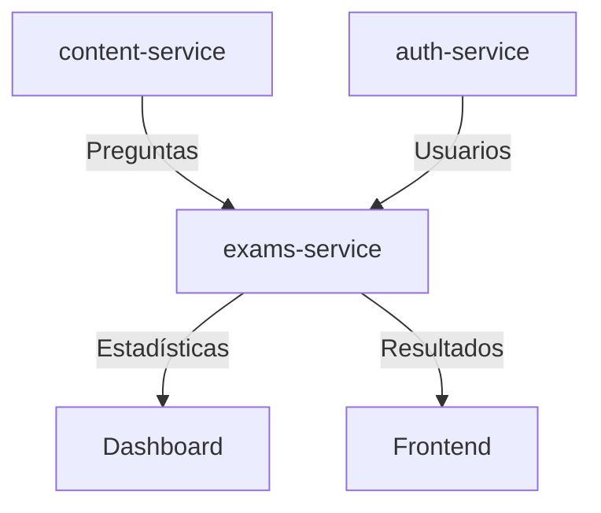

# Diseño del Esquema Prisma - Exams Service

## 📋 Resumen del Diseño

El esquema del `exams-service` está diseñado para soportar un sistema completo de exámenes que se integra perfectamente con el ecosistema BrainRush existente, proporcionando funcionalidad para:

- ✅ Creación y gestión de exámenes por profesores
- ✅ Ejecución de exámenes por estudiantes
- ✅ Seguimiento detallado de intentos y respuestas
- ✅ Estadísticas avanzadas para dashboard
- ✅ Análisis de rendimiento por área y pregunta
- ✅ Optimización para consultas de alto rendimiento

## 🏗️ Arquitectura del Sistema

### Principios de Diseño

1. **Separación de Responsabilidades**: Cada microservicio maneja su dominio específico
2. **Referencias por ID**: Integración loose-coupled con otros servicios usando solo IDs
3. **Optimización para Lectura**: Índices estratégicos para consultas del dashboard
4. **Consistencia de Datos**: Snapshots para mantener integridad histórica
5. **Escalabilidad**: Diseño preparado para grandes volúmenes de datos

### Flujo de Datos



## 📊 Modelos Principales

### 1. Exam - Configuración de Exámenes

El modelo central que define la estructura y configuración de cada examen.

**Campos Clave:**
- `type`: Tipo de examen (SIMULACRO, PRACTICA, QUIZ, etc.)
- `status`: Estado del examen (DRAFT, PUBLISHED, ARCHIVED)
- `timeLimit`: Tiempo límite en minutos
- `maxAttempts`: Número máximo de intentos permitidos
- `shuffleQuestions/shuffleOptions`: Configuración de aleatorización

### 2. ExamQuestion - Preguntas del Examen

Vincula preguntas del `content-service` con exámenes específicos.

**Características:**
- Referencia solo el ID de la pregunta del `content-service`
- Incluye `questionSnapshot` para mantener consistencia histórica
- Orden configurable y puntuación personalizada

### 3. ExamAttempt - Intentos de Examen

Rastrea cada intento de un estudiante en un examen.

**Métricas Incluidas:**
- Tiempo total invertido
- Número de respuestas correctas/incorrectas
- Porcentaje de finalización
- Estado del intento (en progreso, completado, abandonado)

### 4. ExamResponse - Respuestas Individuales

Almacena cada respuesta específica de un estudiante.

**Funcionalidades:**
- Tiempo por pregunta
- Evaluación automática
- Puntos obtenidos
- Referencia a la opción seleccionada

## 📈 Modelos de Estadísticas

### ExamStatistics - Estadísticas por Examen

Métricas agregadas para cada examen:
- Promedio, mediana, máximo y mínimo de puntajes
- Tasa de aprobación
- Análisis de tiempo de completación
- Estadísticas por nivel de dificultad

### StudentAreaStatistics - Rendimiento por Área

Seguimiento del progreso del estudiante en cada área:
- Puntajes promedio por área
- Tendencia de mejora
- Frecuencia de exámenes por área

### StudentProgress - Progreso General

Vista global del rendimiento del estudiante:
- Estadísticas generales de todos los exámenes
- Racha de actividad consecutiva
- Metas semanales y progreso

### QuestionAnalytics - Análisis de Preguntas

Métricas avanzadas para optimización de contenido:
- Índice de dificultad de la pregunta
- Índice de discriminación
- Análisis de distribución de respuestas por opción

## 🔍 Consultas Optimizadas para Dashboard

### 1. Progreso del Estudiante por Área

```prisma
// Obtener progreso por área para un estudiante
const studentAreaProgress = await prisma.studentAreaStatistics.findMany({
  where: { studentId: "student-id" },
  select: {
    areaId: true,
    averageScore: true,
    totalExamsTaken: true,
    improvementTrend: true,
    lastExamDate: true
  },
  orderBy: { averageScore: 'desc' }
});
```

### 2. Próximos Exámenes

```prisma
// Exámenes disponibles para un estudiante
const upcomingExams = await prisma.exam.findMany({
  where: {
    status: 'PUBLISHED',
    OR: [
      { areaId: { in: studentAreaIds } },
      { type: 'SIMULACRO' }
    ]
  },
  select: {
    id: true,
    title: true,
    type: true,
    timeLimit: true,
    totalQuestions: true,
    createdAt: true
  },
  orderBy: { createdAt: 'desc' },
  take: 10
});
```

### 3. Estadísticas del Dashboard

```prisma
// Estadísticas generales del estudiante
const studentStats = await prisma.studentProgress.findUnique({
  where: { studentId: "student-id" },
  select: {
    totalExamsCompleted: true,
    overallAverageScore: true,
    currentStreak: true,
    weeklyExamGoal: true,
    currentWeekExams: true
  }
});
```

### 4. Puntajes Recientes

```prisma
// Últimos intentos completados
const recentScores = await prisma.examAttempt.findMany({
  where: {
    studentId: "student-id",
    status: 'COMPLETED'
  },
  include: {
    exam: {
      select: { title: true, type: true }
    }
  },
  orderBy: { completedAt: 'desc' },
  take: 5
});
```

## 🔧 Flujos de Trabajo Principales

### Creación de Examen (Profesor)

1. **Crear examen base**
```prisma
const exam = await prisma.exam.create({
  data: {
    title: "Simulacro ICFES Matemáticas",
    description: "Simulacro completo de matemáticas",
    type: "SIMULACRO",
    difficulty: "INTERMEDIO",
    timeLimit: 120,
    maxAttempts: 3,
    createdBy: "teacher-id",
    areaId: "matematicas-id"
  }
});
```

2. **Agregar preguntas con snapshot**
```prisma
const questions = await prisma.examQuestion.createMany({
  data: selectedQuestions.map((q, index) => ({
    examId: exam.id,
    questionId: q.id,
    order: index + 1,
    points: q.difficulty === 'AVANZADO' ? 2 : 1,
    questionSnapshot: q // Snapshot completo de la pregunta
  }))
});
```

### Ejecución de Examen (Estudiante)

1. **Iniciar intento**
```prisma
const attempt = await prisma.examAttempt.create({
  data: {
    examId: "exam-id",
    studentId: "student-id",
    attempt: 1,
    totalQuestions: exam.totalQuestions
  }
});
```

2. **Registrar respuesta**
```prisma
const response = await prisma.examResponse.create({
  data: {
    attemptId: attempt.id,
    examQuestionId: "exam-question-id",
    selectedOptionId: "option-id",
    timeSpent: 45,
    isCorrect: true,
    pointsEarned: 1
  }
});
```

3. **Finalizar intento**
```prisma
const completedAttempt = await prisma.examAttempt.update({
  where: { id: attempt.id },
  data: {
    status: 'COMPLETED',
    completedAt: new Date(),
    correctAnswers: correctCount,
    totalScore: totalPoints,
    percentage: (totalPoints / maxPoints) * 100,
    passed: totalPoints >= passingScore
  }
});
```

## 📊 Generación de Estadísticas

### Actualización de Estadísticas del Examen

```typescript
async function updateExamStatistics(examId: string) {
  const completedAttempts = await prisma.examAttempt.findMany({
    where: { examId, status: 'COMPLETED' }
  });

  const scores = completedAttempts.map(a => a.percentage);
  const times = completedAttempts.map(a => a.timeSpent).filter(Boolean);

  await prisma.examStatistics.upsert({
    where: { examId },
    create: {
      examId,
      totalAttempts: completedAttempts.length,
      totalStudents: new Set(completedAttempts.map(a => a.studentId)).size,
      averageScore: scores.reduce((a, b) => a + b, 0) / scores.length,
      highestScore: Math.max(...scores),
      lowestScore: Math.min(...scores),
      passingRate: scores.filter(s => s >= 70).length / scores.length * 100,
      averageTimeSpent: times.reduce((a, b) => a + b, 0) / times.length
    },
    update: {
      // ... same data
      lastCalculated: new Date()
    }
  });
}
```

## 🚀 Optimizaciones de Rendimiento

### Índices Estratégicos

El esquema incluye índices optimizados para las consultas más frecuentes:

```sql
-- Búsquedas por estudiante
CREATE INDEX idx_exam_attempts_student_id ON exam_attempts(student_id);
CREATE INDEX idx_student_progress_student_id ON student_progress(student_id);

-- Filtros por estado y tipo
CREATE INDEX idx_exams_status ON exams(status);
CREATE INDEX idx_exams_type ON exams(type);

-- Ordenamiento por puntajes y fechas
CREATE INDEX idx_exam_attempts_percentage ON exam_attempts(percentage);
CREATE INDEX idx_student_area_statistics_average_score ON student_area_statistics(average_score);
```

### Estrategias de Cache

1. **Cache de estadísticas**: Las estadísticas se calculan de forma asíncrona
2. **Snapshots de preguntas**: Evita consultas al content-service durante la ejecución
3. **Índices compuestos**: Para consultas multi-campo frecuentes

## 🔒 Consideraciones de Seguridad

- **Validación de permisos**: Verificar que el estudiante puede acceder al examen
- **Integridad temporal**: Validar que el examen esté dentro del tiempo límite
- **Prevención de trampas**: Registro de IP y User-Agent para auditoría
- **Encriptación de respuestas**: Para exámenes de alta seguridad (futuro)

## 🔄 Migración y Mantenimiento

### Scripts de Migración

```bash
# Generar migración
npx prisma migrate dev --name "complete_exam_system"

# Aplicar en producción
npx prisma migrate deploy
```

### Tareas de Mantenimiento

1. **Limpieza de intentos abandonados**: Proceso que ejecute cleanup de intentos antiguos
2. **Recálculo de estadísticas**: Job nocturno para recalcular métricas
3. **Archivado de exámenes**: Proceso para archivar exámenes antiguos

## 📚 Próximos Pasos

1. **Implementar servicios de negocio**: Crear los servicios que utilicen este esquema
2. **Agregar validaciones**: Implementar validaciones de negocio en el código
3. **Crear endpoints REST**: Desarrollar la API que exponga la funcionalidad
4. **Implementar WebSockets**: Para actualizaciones en tiempo real del progreso
5. **Agregar reportes**: Generar reportes PDF de resultados y estadísticas

Este esquema proporciona una base sólida y escalable para el sistema de exámenes de BrainRush, con todas las funcionalidades necesarias para el dashboard y la experiencia de usuario completa.
